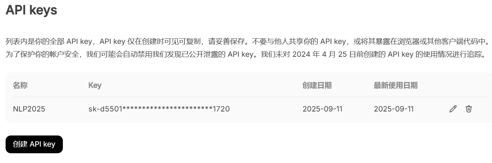
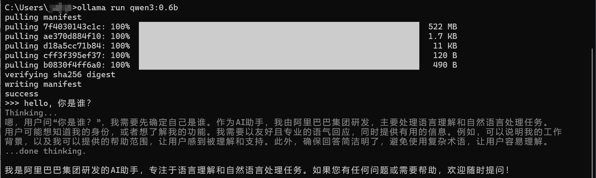

### 作业1: 申请deepseek的api，使用openai 库调用云端大模型。

---
### 作业2: 本地安装ollama工具，尝试在本地部署一个qwen3:0.6b模型

---
### 作业3：阅读政企问答项目的代码，自己描述RAG的实现流程，写为文档。

1. 拆分需求、调研模型
2. 设计框架和功能模块
   - 知识库管理：查询知识库信息，对知识库的增删
   - 文档管理：查询文档信息，删除指定文档，上传文档到指定知识库
   - 语义处理：文本嵌入并返回向量，对一组文本进行重排序
   - 聊天交互：根据目标知识库和用户输入，检索知识库并生成回答
3. 优先实现框架，包括框架设计提到的前端接口和对功能函数的调用传参 
4. 实现功能函数的具体逻辑
   - 文本处理：划分文本块、嵌入、重排序、知识库检索
   - 数据库管理：包括关系型数据库（MySQL或SQLite）和文档数据库(ES)
   - 大模型交互：配置模型信息，知识库与文档构建输入并调用模型
5. 打磨其他细节
6. 项目部署、单元测试、压力测试
