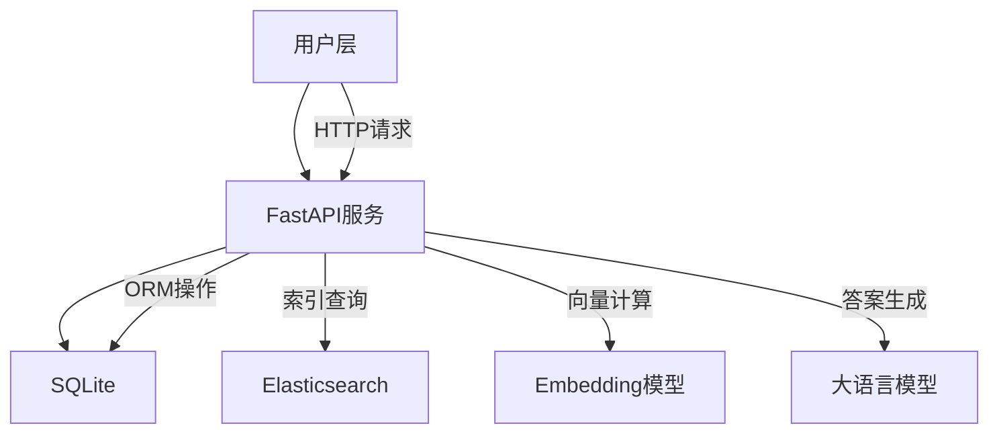
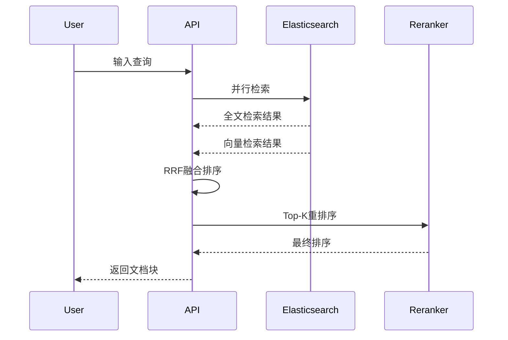

# RAG 系统技术文档：实现原理详解

## 概述

本项目实现了一个基于RAG的智能问答系统，专门针对政府文档的高效检索和问答。系统通过结合**传统检索**与**语义理解**，实现了对复杂文档的深度理解和问答。

## 核心架构

### 架构设计



## RAG 实现原理

### 1. 文档处理流程

#### 1.1 文档解析与分块

```python
# 核心算法：智能分块策略
def split_text_with_overlap(text, chunk_size=256, chunk_overlap=20):
    chunks = []
    start = 0
    while start < len(text):
        end = start + chunk_size
        chunk = text[start:end]
        chunks.append(chunk)
        start = start + chunk_size - chunk_overlap
    return chunks
```

**技术点**：

- **固定窗口+重叠**：保持语义连贯性
- **双粒度存储**：页级粗粒度 + 块级细粒度
- **元数据保留**：页码、文档 ID、知识库关联

#### 1.2 向量化处理

```python
# 使用BGE-small-zh-v1.5模型
embedding = SentenceTransformer("bge-small-zh-v1.5")
vector = embedding.encode(text, normalize_embeddings=True)
# 输出维度：512维float32向量
```

### 2. 混合检索策略

#### 2.1 检索流程图



#### 2.2 检索算法

**a. 全文检索（BM25）**

```json
{
  "query": {
    "bool": {
      "must": [
        {
          "match": {
            "chunk_content": "查询关键词"
          }
        }
      ],
      "filter": [
        {
          "term": {
            "knowledge_id": "指定知识库"
          }
        }
      ]
    }
  }
}
```

**b. 向量检索（KNN）**

```json
{
  "knn": {
    "field": "embedding_vector",
    "query_vector": [0.1, 0.2, ..., 0.512],
    "k": 50,
    "num_candidates": 100,
    "filter": {
      "term": {"knowledge_id": "指定知识库"}
    }
  }
}
```

**c. RRF 融合算法**

```python
# Reciprocal Rank Fusion公式
def rrf_score(rank1, rank2, k=60):
    return 1/(rank1 + k) + 1/(rank2 + k)

# 融合排序实现
fusion_score = {}
for idx, doc in enumerate(full_text_results):
    doc_id = doc["_id"]
    fusion_score[doc_id] += 1/(idx + 60)
```

#### 2.3 Rerank优化

```python
# 使用交叉编码器
text_pairs = [[query, chunk] for chunk in candidate_chunks]
scores = reranker.compute_score(text_pairs)
ranked_indices = np.argsort(scores)[::-1]
```

### 3. 答案生成

#### 3.1 提示词模板

```python
BASIC_QA_TEMPLATE = '''现在的时间是{#TIME#}。你是一个专家，你擅长回答用户提问，帮我结合给定的资料，回答下面的问题。
如果问题无法从资料中获得，或无法从资料中进行回答，请回答无法回答。如果提问不符合逻辑，请回答无法回答。
如果问题可以从资料中获得，则请逐步回答。

资料：
{#RELATED_DOCUMENT#}

问题：{#QUESTION#}
'''
```

#### 3.2 上下文组装

```python
# 检索结果处理
related_records = query_document(query, knowledge_id)
context = '\n'.join([record["chunk_content"] for record in related_records[:5]])
```

## 数据存储架构

### 1. 索引结构设计

#### 1.1 Document Meta 索引

```yaml
document_meta:
  properties:
    document_name:
      type: text
      analyzer: ik_max_word # 中文分词
    abstract:
      type: text
      analyzer: ik_max_word
    file_path:
      type: text
```

#### 1.2 Chunk Info 索引

```yaml
chunk_info:
  properties:
    chunk_content:
      type: text
      analyzer: ik_max_word
    embedding_vector:
      type: dense_vector
      dims: 512
      element_type: float
      index: true
      index_options:
        type: int8_hnsw # HNSW近似搜索
```

### 2. 数据库表设计

#### 2.1 知识库表

```sql
CREATE TABLE knowledge_database (
    knowledge_id INTEGER PRIMARY KEY AUTOINCREMENT,
    title VARCHAR NOT NULL,
    category VARCHAR,
    create_dt DATETIME DEFAULT CURRENT_TIMESTAMP,
    update_dt DATETIME DEFAULT CURRENT_TIMESTAMP
);
```

#### 2.2 文档表

```sql
CREATE TABLE knowledge_document (
    document_id INTEGER PRIMARY KEY AUTOINCREMENT,
    title VARCHAR NOT NULL,
    category VARCHAR,
    knowledge_id INTEGER,
    file_path VARCHAR,
    file_type VARCHAR,
    create_dt DATETIME DEFAULT CURRENT_TIMESTAMP,
    FOREIGN KEY (knowledge_id) REFERENCES knowledge_database(knowledge_id)
);
```
