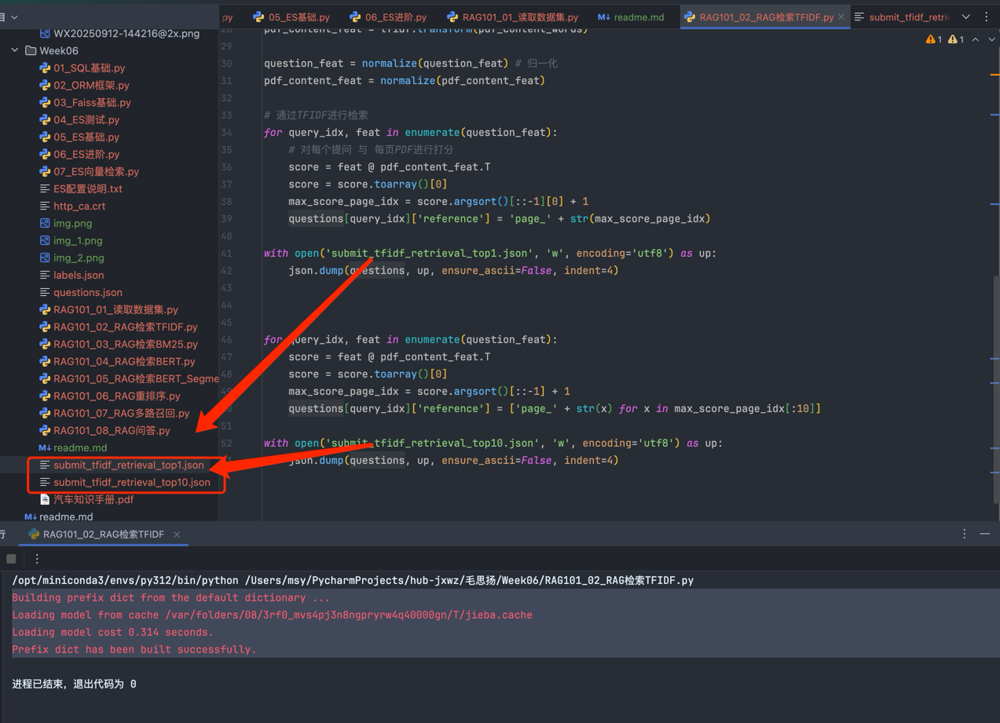

# 第六周

1、 sqlite、 orm、 es 的使用学习，自己构建数据插入

 实验sqlite 存储、检索不同的数据，截图

​        **我自己做的小项目 python写的人脸库 用到的sqlite**

​        **数据库结构截图**

​        

​        **crud相关代码**

​        

```python
# 初始化数据库连接
def init_db(db_path='/Users/msy/javaProject/git/baichuan-client/baichuanclient/data/db/report-base-data.db'):
    # 确保数据库文件的目录存在
    db_dir = os.path.dirname(db_path)
    if db_dir and not os.path.exists(db_dir):
        os.makedirs(db_dir, exist_ok=True)
    
    # 连接数据库（如果文件不存在会自动创建）
    conn = sqlite3.connect(db_path, check_same_thread=False)
    
    # 创建表（如果不存在）
    with conn:
        conn.execute('''
            CREATE TABLE IF NOT EXISTS users (
                id INTEGER PRIMARY KEY AUTOINCREMENT,
                user_id TEXT,
                name TEXT,
                gender TEXT,
                age INTEGER,
                birthday TEXT,
                company TEXT,
                department TEXT,
                face_raw_base64 TEXT,
                face_aligned_base64 TEXT,
                face_vector BLOB,
                created_at DATETIME,
                updated_at DATETIME
            )
        ''')
    return conn
# 插入用户数据到数据库
def insert_user(conn, user_info):
    cursor = conn.cursor()
    cursor.execute('''
        INSERT INTO users (user_id, name, gender, age, birthday, company, department, face_raw_base64, face_aligned_base64, face_vector, created_at, updated_at)
        VALUES (?, ?, ?, ?, ?, ?, ?, ?, ?, ?, ?, ?)
    ''', (
        user_info.get('user_id'),
        user_info.get('name'),
        user_info.get('gender'),
        user_info.get('age'),
        user_info.get('birthday'),
        user_info.get('company'),
        user_info.get('department'),
        user_info.get('face_raw_base64'),
        user_info.get('face_aligned_base64'),
        user_info.get('face_vector').tobytes() if user_info.get('face_vector') is not None else None,
        user_info.get('created_at', datetime.now().replace(microsecond=0)),
        user_info.get('updated_at', datetime.now().replace(microsecond=0)),
    ))
    conn.commit()
    return cursor.lastrowid # 返回插入的用户 ID

# 查询所有向量用于构建 Faiss 索引
def load_all_vectors(conn):
    cursor = conn.cursor()
    cursor.execute("SELECT id, face_vector FROM users WHERE face_vector IS NOT NULL")
    users = cursor.fetchall()
    ids = []
    vectors = []
    for user in users:
        ids.append(user[0])
        vector = np.frombuffer(user[1], dtype=np.float32)
        vectors.append(vector)
    return np.array(vectors).astype('float32'), ids


# 查询用户信息通过 id
def get_user_by_id(conn, id):
    cursor = conn.cursor()
    cursor.execute("SELECT * FROM users WHERE id=?", (id,))
    row = cursor.fetchone()
    if row:
        return {
            'id': row[0],
            'user_id': row[1],
            'name': row[2],
            'gender': row[3],
            'age': row[4],
            'birthday': row[5],
            'company': row[6],
            'department': row[7],
            'face_raw_base64': row[8],
            'face_aligned_base64': row[9],
            # 'face_vector': np.frombuffer(row[10], dtype=np.float32),
            'created_at': row[11],
            'updated_at': row[12]
        }
    return None

def get_all_company(conn):
    cursor = conn.cursor()
    cursor.execute("SELECT DISTINCT company FROM users")
    companies = [row[0] for row in cursor.fetchall()]
    return companies

def search_users(db, search_params, page=1, pageSize=10):
    """
    搜索用户信息（支持分页）
    
    参数:
    db (sqlite3.Connection): 数据库连接
    search_params (dict): 包含搜索条件的字典
    page (int): 页码（从1开始）
    pageSize (int): 每页记录数
    
    返回:
    tuple: 包含两个元素的元组 (当前页数据, 总记录数)
    """
    # 构建基础查询
    query = 'SELECT id,user_id, name, gender, age, birthday, company, department, face_raw_base64, created_at, updated_at FROM users WHERE 1=1'
    params = []
    
    # 添加搜索条件
    if 'name' in search_params and (search_params['name'] != '' and  search_params['name'] != None) :
        query += ' AND name LIKE ?'
        params.append(f'%{search_params["name"]}%')
    
    if 'user_id' in search_params and (search_params['user_id'] != '' and search_params['user_id'] != None) :
        query += ' AND user_id = ?'
        params.append(search_params['user_id'])
    
    if 'company' in search_params and (search_params['company'] != '' and search_params['company'] != None) :
        query += ' AND company LIKE ?'
        params.append(f'%{search_params["company"]}%')
    
    # 计算偏移量
    offset = (page - 1) * pageSize
    
    # 添加分页条件
    query += ' LIMIT ? OFFSET ?'
    params.extend([pageSize, offset])
    
    # 执行查询
    cursor = db.execute(query, params)
    users = cursor.fetchall()
    columns = [desc[0] for desc in cursor.description]
    users_dict = [dict(zip(columns, user)) for user in users]
    # 查询总记录数
    count_query = 'SELECT COUNT(*) FROM (' + query.split('LIMIT')[0] + ') AS count_query'
    count_params = params[:len(params) - 2] if len(params) > 2 else []
    cursor = db.execute(count_query, count_params)
    total = cursor.fetchone()[0]
    return users_dict, total  # 确保返回两个值

def del_users_by_id(conn, ids):
    if not ids:
        return 0  # 空列表直接返回 0 条记录被删除
    cursor = conn.cursor()
    placeholders = ','.join(['?'] * len(ids))
    query = f"DELETE FROM users WHERE id IN ({placeholders})"
    cursor.execute(query, ids)
    conn.commit()
    return cursor.rowcount  # 返回受影响的行数

```


 **实验es 存储、检索不同的数据，截图**

es测试

```bash
/opt/miniconda3/envs/py312/bin/python /Users/msy/PycharmProjects/hub-jxwz/毛思扬/Week06/04_ES测试.py 
--- 正在测试 Elasticsearch 连接 ---
连接成功！
{
  "name": "9a2158a98342",
  "cluster_name": "docker-cluster",
  "cluster_uuid": "RtzphL9YQ3CnlSnztTW09Q",
  "version": {
    "number": "9.1.4",
    "build_flavor": "default",
    "build_type": "docker",
    "build_hash": "0b7fe68d2e369469ff9e9f344ab6df64ab9c5293",
    "build_date": "2025-09-16T22:05:19.073893347Z",
    "build_snapshot": false,
    "lucene_version": "10.2.2",
    "minimum_wire_compatibility_version": "8.19.0",
    "minimum_index_compatibility_version": "8.0.0"
  },
  "tagline": "You Know, for Search"
}

==================================================

--- 正在测试常见的 Elasticsearch 内置分词器 ---

使用分词器：standard
原始文本: 'Hello, world! This is a test.'
分词结果: ['hello', 'world', 'this', 'is', 'a', 'test']

使用分词器：simple
原始文本: 'Hello, world! This is a test.'
分词结果: ['hello', 'world', 'this', 'is', 'a', 'test']

使用分词器：whitespace
原始文本: 'Hello, world! This is a test.'
分词结果: ['Hello,', 'world!', 'This', 'is', 'a', 'test.']

使用分词器：english
原始文本: 'Hello, world! This is a test.'
分词结果: ['hello', 'world', 'test']

==================================================

--- 正在测试 IK 分词器 ---

使用 IK 分词器：ik_smart
原始文本: '我在使用Elasticsearch，这是我的测试。'
分词结果: ['我', '在', '使用', 'elasticsearch', '这是', '我', '的', '测试']

使用 IK 分词器：ik_max_word
原始文本: '我在使用Elasticsearch，这是我的测试。'
分词结果: ['我', '在', '使用', 'elasticsearch', '这是', '我', '的', '测试']

进程已结束，退出代码为 0

```


es存储+检索


2、 RAG 实验代码，重新跑通。截图

​		RAG101_01_读取数据集


​		RAG101_02_RAG检索TFIDF


​		RAG101_03_RAG检索BM25


​		RAG101_04_RAG检索BERT


​		RAG101_05_RAG检索BERT_Segment


​		RAG101_06_RAG重排序


​		RAG101_07_RAG多路召回


​		RAG101_08_RAG问答

